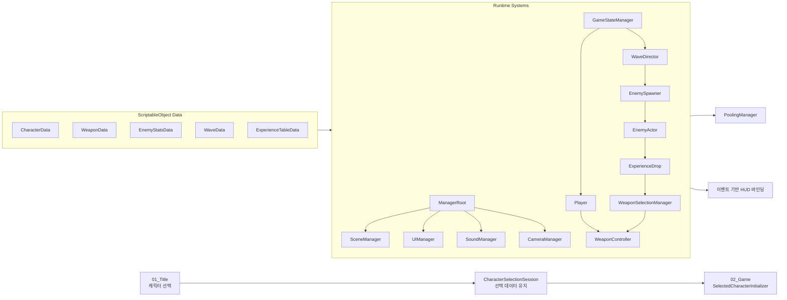

# 달토끼 돌격! Moon Rabbit Rush!

> 달을 침공한 외계 세력에 맞서 인류의 최후 방어선과 달 기지를 지켜내는 2D 뱀서라이크 액션 게임

NHN **Game X AI 해커톤** 출품을 위해 제작한 Unity WebGL 게임입니다.
귀여운 달토끼 캐릭터와 빠르게 성장하는 무기 조합, 웨이브와 보스가 반복되는 생존 전투를 결합했습니다.

[](https://unity.com/)
[](https://gugyeoj1n.github.io/MoonRabbitRush/)
[](https://learn.microsoft.com/dotnet/csharp/)

🎮 **[WebGL 빌드 플레이하기](https://gugyeoj1n.github.io/MoonRabbitRush/)**

<p align="center">
  
</p>

## 게임 소개

플레이어는 달토끼를 조작해 사방에서 몰려오는 외계 몬스터를 처치하고, 맵 중앙의 달 기지를 방어해야 합니다. 몬스터가 떨어뜨린 경험치 결정을 모아 레벨을 올리고, 무작위로 제시되는 무기 중 하나를 선택해 자신만의 전투 조합을 완성할 수 있습니다.

일반 웨이브를 돌파하면 대형 UFO 보스가 등장합니다. 플레이어와 달 기지 중 하나가 파괴되기 전까지 웨이브와 보스 라운드를 반복하며 더 높은 점수를 기록하는 것이 목표입니다.

## 팀원 및 역할

<table>
  <thead>
    <tr>
      <th align="center">이름</th>
      <th align="center">역할</th>
      <th align="left">주요 담당 영역</th>
    </tr>
  </thead>
  <tbody>
    <tr>
      <td align="center" width="150">
        <a href="https://github.com/gugyeoj1n">
          
          <br />
          <b>곽우진</b>
        </a>
      </td>
      <td align="center">
        Unity 클라이언트 및<br />
        게임 시스템 개발
      </td>
      <td>
        플레이어, 캐릭터 선택, 무기, 몬스터, 웨이브, 보스, 성장,
        기지 방어, 게임 흐름, 전투 연출, 밸런싱 및 최적화
      </td>
    </tr>
    <tr>
      <td align="center" width="150">
        <a href="https://github.com/TYDTYD">
          
          <br />
          <b>이승민</b>
        </a>
      </td>
      <td align="center">
        Unity 클라이언트 및<br />
        UI 개발
      </td>
      <td>
        UI Page·Popup 구조, UI Navigation, 데이터 바인딩,
        HP·EXP HUD, Input System, Cinemachine, 사운드 및 게임 UI
      </td>
    </tr>
    <tr>
      <td align="center" width="150">
        <a href="https://github.com/zizoo104">
          
          <br />
          <b>심재현</b>
        </a>
      </td>
      <td align="center">2D 아트</td>
      <td>
        플레이어·몬스터·보스 콘셉트, 스프라이트 시트,
        애니메이션 및 게임 아트 리소스 제작
      </td>
    </tr>
  </tbody>
</table>

### 핵심 특징

- 서로 다른 능력치와 시작 무기를 가진 플레이어블 달토끼 3종
- 자동 공격 액티브 무기 5종과 능력치를 강화하는 패시브 무기 4종
- 무기 획득 및 강화를 선택하는 뱀서라이크 방식의 레벨업
- 근접, 투사체, 텔레그래프 공격을 사용하는 일반 몬스터 3종
- 미사일 폭격, 레이저, 중력장을 사용하는 대형 UFO 보스
- 플레이어와 별도의 체력을 갖는 달 기지 방어 목표
- 회복, 이동 속도 증가, 무적 효과를 제공하는 필드 아이템
- 반복 웨이브, 점수 및 로컬 최고 기록 시스템

<p align="center">
  
</p>

## 플레이 방법

| 입력 | 기능 |
| --- | --- |
| 방향키 | 캐릭터 이동 |
| `Q`, `W`, `E` | 습득 순서에 따라 배정된 만렙 무기의 액티브 스킬 사용 |
| `ESC` | 일시정지 및 시스템 메뉴 |
| 마우스 | 캐릭터·레벨업 선택 및 UI 조작 |

공격은 자동으로 실행됩니다. 적의 공격 범위를 피하면서 경험치 결정을 수집하고, 레벨업 선택지를 통해 새로운 무기를 얻거나 기존 무기를 강화하세요.

### 게임 진행

1. 타이틀 화면에서 게임 시작을 선택합니다.
2. 사용할 캐릭터를 선택합니다.
3. 방향키로 이동하며 자동 공격으로 몬스터를 처치합니다.
4. 경험치 결정을 모아 레벨업하고 무기를 획득하거나 강화합니다.
5. 일반 웨이브를 전멸시키고 출현한 보스를 공략합니다.
6. 반복되는 웨이브와 보스 라운드에서 최대한 오래 생존해 최고 점수를 갱신합니다.

<p align="center">
  
</p>

## 플레이어블 캐릭터

| 캐릭터 | 특징 | 시작 무기 |
| --- | --- | --- |
| 달토끼 | 균형 잡힌 기본 능력치를 가진 표준형 캐릭터 | 당근 미사일 |
| 메카 토끼 | 높은 체력과 방어력을 활용하는 생존형 캐릭터 | 월광 레이저포 |
| 외계 토끼 | 빠른 이동 속도와 지속 회복을 가진 기동형 캐릭터 | 초승달 부메랑 |

## 전투 콘텐츠

### 액티브 무기

- **당근 미사일** — 가장 가까운 적을 추적하는 유도 투사체
- **충격 드론** — 플레이어 주변을 공전하며 접촉한 적에게 피해를 주는 드론
- **우주 당근 지뢰** — 주변에 매설된 후 적을 감지해 범위 피해를 주는 지뢰
- **초승달 부메랑** — 적을 향해 날아갔다가 플레이어에게 되돌아오는 관통 무기
- **월광 레이저포** — 플레이어 주변에서 조준 후 레이저를 발사하는 부유형 무기

액티브 무기가 최대 레벨에 도달하면 `Q`, `W`, `E` 키로 고유 액티브 스킬을 사용할 수 있습니다.

### 패시브 무기

- **월광 증폭 렌즈** — 모든 무기의 공격력 증가
- **중력 확장 코어** — 모든 무기의 크기 및 공격 범위 증가
- **토끼발 부스터** — 플레이어 이동 속도 증가
- **복제 당근 안테나** — 무기 투사체 또는 생성 개수 증가

### 필드 아이템

- **회복 당근** — 플레이어 체력 회복
- **토끼 제트팩** — 일정 시간 동안 이동 속도 대폭 증가
- **월광 보호막** — 일정 시간 동안 피해를 무효화

<p align="center">
  
</p>

## 기술 구조

Moon Rabbit Rush는 콘텐츠 추가와 밸런스 수정을 빠르게 반복할 수 있도록 데이터와 실행 로직을 분리했습니다.



### 주요 설계

- **ScriptableObject 기반 데이터**
  캐릭터 능력치와 애니메이션, 무기별 레벨 수치, 몬스터 스탯, 웨이브 구성 및 경험치 테이블을 에셋으로 관리합니다.

- **컴포넌트 기반 적 행동**
  `EnemyActor`를 중심으로 이동, 체력, 공격과 피드백을 분리했습니다. 추적형·원거리형 등 새로운 적은 필요한 행동 컴포넌트를 조합해 확장할 수 있습니다.

- **공통 전투 계약**
  `IDamageable`과 `DamageInfo`를 통해 플레이어, 몬스터와 달 기지가 동일한 피해 전달 구조를 사용합니다.

- **데이터 기반 무기 확장**
  `WeaponData`와 레벨별 스탯 테이블을 실행 컴포넌트와 분리해 신규 무기와 패시브 효과를 추가할 수 있습니다.

- **게임 상태 관리**
  `Playing`, `LevelUp`, `Paused`, `Dying`, `GameOver` 상태를 구분해 입력, 시간 정지와 UI 표시 충돌을 방지합니다.

- **오브젝트 풀링**
  몬스터, 투사체, 경험치 아이템, 텔레그래프, 전투 이펙트와 데미지 텍스트를 재사용해 WebGL 환경의 런타임 할당과 GC 부하를 줄였습니다.

- **비동기 생명주기 관리**
  UniTask와 CancellationToken을 사용해 웨이브, 씬 전환과 연출 작업이 오브젝트 또는 씬 종료 시 안전하게 취소되도록 구성했습니다.

- **이벤트 기반 UI 갱신**
  플레이어 체력, 경험치, 웨이브, 남은 몬스터와 무기 상태를 변경 이벤트에 맞춰 HUD에 반영합니다.

<p align="center">
  
</p>

## 프로젝트 구조

```text
Assets
├─ Art                  # 캐릭터, 몬스터, 무기 및 이펙트 이미지
├─ Audio                # BGM 및 SFX
├─ Animations           # 애니메이션 클립과 컨트롤러
├─ Data                 # 캐릭터, 적, 무기, 웨이브 ScriptableObject
├─ Prefabs              # 게임 플레이 및 UI 프리팹
├─ Scenes
│  ├─ 01_Title.unity
│  └─ 02_Game.unity
├─ Scripts
│  ├─ Runtime           # 실제 게임 실행 코드
│  └─ Editor            # 빌드 및 데이터 편집 도구
└─ UI                   # 폰트, 아이콘 및 UI 리소스
```

## 개발 환경

| 항목 | 내용 |
| --- | --- |
| Engine | Unity `6000.5.4f1` |
| Render Pipeline | Universal Render Pipeline `17.6.0` |
| Language | C# |
| Target Platform | WebGL |
| Input | Unity Input System `1.19.0` |
| Camera | Cinemachine `3.1.7` |
| Async | UniTask |
| UI | Unity UI, TextMesh Pro, R3 데이터 바인딩 |
| CI/CD | GitHub Actions, GitHub Pages |

## 실행 방법

### WebGL 빌드

[배포된 WebGL 페이지](https://gugyeoj1n.github.io/MoonRabbitRush/)에 접속하면 별도의 설치 없이 브라우저에서 플레이할 수 있습니다.

### Unity Editor

1. 저장소를 Git LFS 파일과 함께 Clone합니다.

   ```bash
   git lfs install
   git clone https://github.com/gugyeoj1n/MoonRabbitRush.git
   ```

2. Unity Hub에서 프로젝트 폴더를 추가합니다.
3. Unity `6000.5.4f1` 버전으로 프로젝트를 엽니다.
4. `Assets/Scenes/01_Title.unity` 씬을 엽니다.
5. Play 버튼을 눌러 실행합니다.

> 다른 Unity 버전으로 열 경우 패키지 또는 에셋 직렬화 결과가 달라질 수 있으므로 프로젝트에 명시된 버전 사용을 권장합니다.

## 빌드 및 배포

`main` 브랜치에 변경사항이 반영되면 GitHub Actions가 다음 과정을 자동으로 수행합니다.

1. Git LFS를 포함한 저장소 Checkout
2. Unity Library 캐시 복원
3. Unity `6000.5.4f1`을 이용한 WebGL 빌드
4. 빌드 결과를 GitHub Pages 아티팩트로 업로드
5. GitHub Pages 자동 배포

워크플로 파일은 [`.github/workflows/main.yml`](.github/workflows/main.yml)에서 확인할 수 있습니다.

## AI 활용

본 프로젝트는 기획, 프로그래밍, 리팩터링 및 아트 제작 과정에서 생성형 AI를 협업 도구로 활용했습니다.

- **OpenAI Codex** — 기능 설계, Unity C# 구현, 오류 분석, 리팩터링, Git 작업 및 기술 문서화
- **Cursor** — 코드 작성 보조, 기존 코드 탐색 및 빠른 수정
- **Aether AI** — 캐릭터, 몬스터, 아이콘 등 2D 비주얼 에셋의 기획 및 제작 보조

AI 생성 결과는 그대로 사용하는 방식이 아니라 팀원이 게임 콘셉트와 기술 요구사항에 맞게 검토·수정하고, Unity 프로젝트에 적용한 뒤 실제 플레이를 통해 반복 검증했습니다.

## 제작 정보

- 프로젝트명: **달토끼 돌격! Moon Rabbit Rush!**
- 행사: **NHN Game X AI 해커톤**
- 장르: 2D 탑다운 뱀서라이크 액션
- 플랫폼: WebGL
